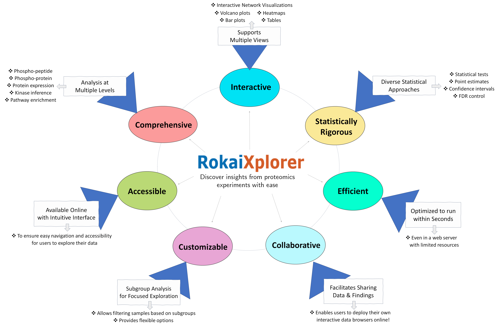

# RokaiXplorer


## What is RokaiXplorer?
RokaiXplorer is an interactive tool to analyze proteomics and phospho-proteomics data.
You can use this tool to:
- Identify significant changes in phosphorylation and protein expression,
- Perform enrichment of gene ontology (GO) terms,
- Infer kinase activities using RoKAI

To access the application through a user-friendly interface, please visit: [RokaiXplorer application](http://explorer.rokai.io). 

## Running Locally
To run RoKAI App locally on your R installation, simply run:
```
library(shiny)
runGitHub("rokaixplorer", "serhan-yilmaz")
```
### Running an earlier version of the application
If desired, you can also run an earlier version of the application. For this purpose, specify the ref parameter to be one of the [release versions](https://github.com/serhan-yilmaz/RokaiApp/releases), e.g.:
```
library(shiny)
runGitHub("rokaixplorer", "serhan-yilmaz", ref = "v0.6.0")
```

## Share Your Discoveries with RokaiXplorer!
Starting from v0.5.0, RokaiXplorer now allows you to easily share your datasets and analysis results online through an interactive data browser. Explore some examples below:

 - [ExampleApp](https://serhan-yilmaz.shinyapps.io/exampleapp/)
 - [ADXplorer](https://yilmazs.shinyapps.io/ADXplorer/) (an application on Alzheimer's disease data)
 
  For a detailed tutorial, please visit <a href = 'https://github.com/serhan-yilmaz/RokaiXplorer/blob/main/deploy/README.md' target = "_">the deployment page</a>.
